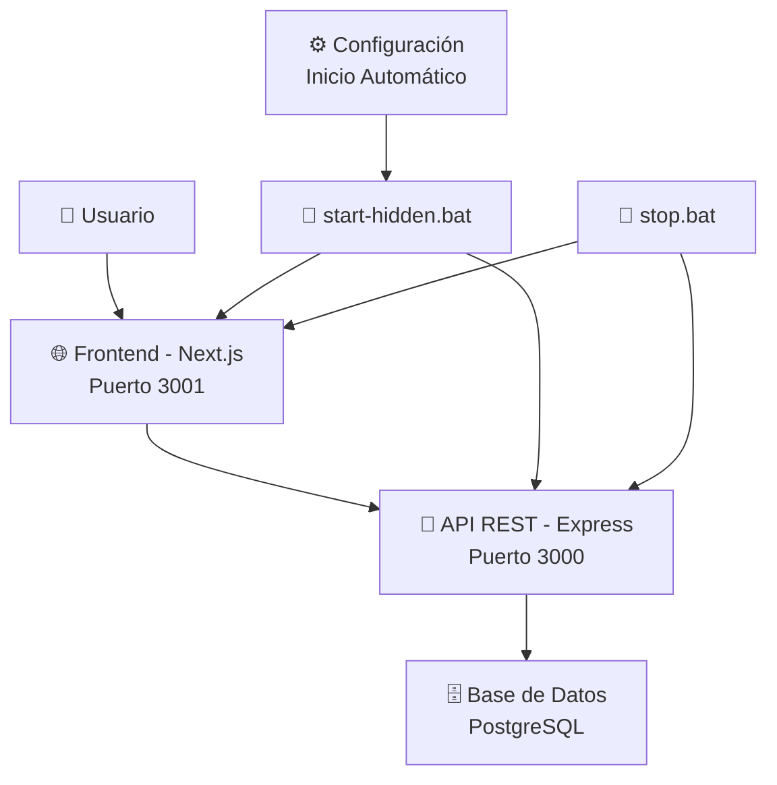
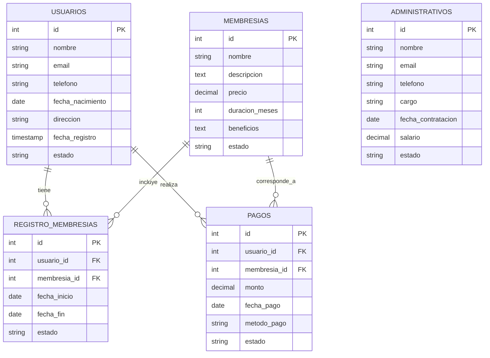

# 🏋️ GIMNASIO APP - Sistema de Gestión Completo

<div align="center">


**Sistema completo de gestión para gimnasios con interfaz web moderna y API robusta**

[🚀 Inicio Rápido](#-inicio-rápido) • [📖 Documentación](#-documentación) • [🛠️ Configuración](#️-configuración) • [🔧 Desarrollo](#-desarrollo)

</div>

---

## 📋 Tabla de Contenidos

- [🎯 Descripción del Proyecto](#-descripción-del-proyecto)
- [✨ Características Principales](#-características-principales)
- [🏗️ Arquitectura del Sistema](#️-arquitectura-del-sistema)
- [🚀 Inicio Rápido](#-inicio-rápido)
- [🛠️ Configuración Detallada](#️-configuración-detallada)
- [📱 Uso de la Aplicación](#-uso-de-la-aplicación)
- [🔧 Desarrollo](#-desarrollo)
- [📊 Base de Datos](#-base-de-datos)
- [🌐 API Endpoints](#-api-endpoints)
- [🔒 Seguridad](#-seguridad)
- [🚨 Solución de Problemas](#-solución-de-problemas)
- [📚 Recursos Adicionales](#-recursos-adicionales)

---

## 🎯 Descripción del Proyecto

**Gimnasio App** es un sistema completo de gestión diseñado específicamente para la administración de gimnasios y centros de fitness. Combina una **API REST robusta** construida con Node.js y Express, con una **interfaz web moderna** desarrollada en Next.js y React.

### 🎪 ¿Qué Hace?

- **Gestión de Miembros:** Registro, seguimiento y administración completa de usuarios
- **Control de Membresías:** Diferentes tipos de planes y subscripciones
- **Gestión Financiera:** Control de pagos, facturas y reportes económicos
- **Panel Administrativo:** Herramientas completas para administradores
- **Reportes y Analytics:** Métricas y estadísticas del negocio
- **Interfaz Intuitiva:** Dashboard moderno y fácil de usar

---

## ✨ Características Principales

### 🚀 **Funcionalidades Core**

| Módulo | Descripción | Estado |
|--------|-------------|---------|
| 👥 **Gestión de Usuarios** | CRUD completo de miembros del gimnasio | ✅ Completo |
| 🎯 **Membresías** | Gestión de tipos de membresías y planes | ✅ Completo |
| 💰 **Pagos** | Control de pagos, facturas y finanzas | ✅ Completo |
| 📋 **Registros** | Historial de inscripciones y actividades | ✅ Completo |
| 👨‍💼 **Administrativos** | Gestión de staff y permisos | ✅ Completo |
| 📊 **Reportes** | Analytics y métricas del negocio | ✅ Completo |

### 🔧 **Características Técnicas**

- **⚡ Ejecución Oculta:** Procesos invisibles que no molestan al usuario
- **🔄 Inicio Automático:** Se ejecuta automáticamente al encender la PC
- **🛡️ Auto-Restart:** Reinicio automático en caso de fallos
- **📱 Responsive Design:** Funciona perfectamente en todos los dispositivos
- **🔒 Seguro:** Validaciones y controles de seguridad integrados
- **📈 Escalable:** Arquitectura preparada para crecimiento

---

## 🏗️ Arquitectura del Sistema

### 📊 **Diagrama de Arquitectura**



### 🔧 **Stack Tecnológico**

#### **Frontend (Puerto 3001)**
- **Framework:** Next.js 15.5.4
- **UI Library:** React 19.1.0
- **Styling:** Tailwind CSS 4.0
- **HTTP Client:** Axios
- **PDF Generation:** jsPDF + AutoTable
- **Excel Export:** XLSX
- **Language:** TypeScript

#### **Backend (Puerto 3000)**
- **Runtime:** Node.js
- **Framework:** Express 5.1.0
- **ORM:** Sequelize 6.37.7
- **Database:** PostgreSQL
- **CORS:** Habilitado para desarrollo
- **Environment:** dotenv para configuración

#### **Base de Datos**
- **Motor:** PostgreSQL
- **Host:** localhost
- **Puerto:** 5432 (por defecto)
- **Esquema:** Relacional normalizado

---

## 🚀 Inicio Rápido

### ⚡ **Opción 1: Inicio Inmediato (Recomendado)**

```bash
# 1. Configurar inicio automático (solo una vez)
configurar-inicio-automatico.bat

# 2. Reiniciar tu PC
# 3. ¡Listo! Ve a http://localhost:3001
```

### 🔧 **Opción 2: Inicio Manual**

```bash
# Iniciar aplicación manualmente
start-hidden.bat

# Abrir en navegador
http://localhost:3001
```

### 🛑 **Detener Servicios**

```bash
# Detener todos los servicios
stop.bat
```

---

## 🛠️ Configuración Detallada

### 📋 **Prerrequisitos**

1. **Node.js** (v16 o superior)
2. **PostgreSQL** (v12 o superior)
3. **Windows** (Scripts optimizados para Windows)
4. **Navegador moderno** (Chrome, Firefox, Edge)

### 🗄️ **Configuración de Base de Datos**

1. **Instalar PostgreSQL:**
   ```bash
   # Descargar desde: https://www.postgresql.org/download/
   # Instalar con configuración por defecto
   ```

2. **Crear Base de Datos:**
   ```sql
   CREATE DATABASE db_gimnasio;
   CREATE USER postgres WITH PASSWORD '123456';
   GRANT ALL PRIVILEGES ON DATABASE db_gimnasio TO postgres;
   ```

3. **Configurar Variables de Entorno:**
   
   Archivo: `backend-gym/.env`
   ```env
   DB_NAME=db_gimnasio
   DB_USER=postgres
   DB_PASS=123456
   DB_HOST=localhost
   PORT=3000
   ```

### 📦 **Instalación de Dependencias**

```bash
# Instalar todas las dependencias
npm run install:all

# O instalar por separado:
npm run install:backend    # Solo backend
npm run install:frontend   # Solo frontend
```

### 🔧 **Configuración de Puertos**

| Servicio | Puerto | URL | Propósito |
|----------|--------|-----|-----------|
| **Frontend** | 3001 | http://localhost:3001 | Interfaz de usuario |
| **Backend** | 3000 | http://localhost:3000 | API REST |
| **Database** | 5432 | localhost:5432 | PostgreSQL |

### ⚙️ **Configuración de Inicio Automático**

1. **Activar inicio automático:**
   ```bash
   configurar-inicio-automatico.bat
   ```

2. **Desactivar inicio automático:**
   ```bash
   desactivar-inicio-automatico.bat
   ```

3. **Verificación:**
   - Al reiniciar PC, la aplicación se inicia automáticamente
   - Procesos completamente ocultos
   - Disponible en http://localhost:3001 tras 10 segundos

---

## 📱 Uso de la Aplicación

### 🏠 **Dashboard Principal**

Al acceder a http://localhost:3001, encontrarás:

- **📊 Panel de Control:** Métricas y estadísticas principales
- **👥 Gestión de Usuarios:** Lista, creación y edición de miembros
- **🎯 Membresías:** Configuración de planes y tipos
- **💰 Pagos:** Control financiero y facturación
- **📋 Registros:** Historial de actividades
- **👨‍💼 Administrativos:** Gestión de personal

### 🔐 **Funcionalidades por Módulo**

#### 👥 **Módulo de Usuarios**
- ✅ Registro de nuevos miembros
- ✅ Edición de información personal
- ✅ Búsqueda y filtrado avanzado
- ✅ Exportación a Excel/PDF
- ✅ Gestión de estados (activo/inactivo)

#### 🎯 **Módulo de Membresías**
- ✅ Crear tipos de membresías personalizadas
- ✅ Configurar precios y duraciones
- ✅ Asignar membresías a usuarios
- ✅ Control de vencimientos
- ✅ Renovaciones automáticas

#### 💰 **Módulo de Pagos**
- ✅ Registro de pagos por membresía
- ✅ Generación de facturas
- ✅ Control de mora y vencimientos
- ✅ Reportes financieros
- ✅ Exportación contable

#### 📋 **Módulo de Registros**
- ✅ Historial completo de inscripciones
- ✅ Seguimiento de actividades
- ✅ Reportes de asistencia
- ✅ Analytics de uso
- ✅ Métricas de retención

### 📊 **Reportes y Analytics**

- **📈 Métricas de Negocio:** Ingresos, usuarios activos, conversiones
- **💹 Reportes Financieros:** Flujo de caja, pagos pendientes, proyecciones
- **👥 Analytics de Usuarios:** Demografía, retención, satisfacción
- **📋 Reportes Operacionales:** Uso de instalaciones, horarios pico

---

## 🔧 Desarrollo

### 🛠️ **Comandos de Desarrollo**

```bash
# Iniciar en modo desarrollo (con hot reload)
cd backend-gym && npm run dev     # Backend con nodemon
cd frontend-gym && npm run dev    # Frontend con hot reload

# Construir para producción
cd frontend-gym && npm run build  # Build de Next.js

# Linting y calidad de código
cd frontend-gym && npm run lint   # ESLint
```

### 📁 **Estructura del Proyecto**

```
📁 Gimnasio/
├── 📁 backend-gym/              # API REST - Node.js
│   ├── app.js                   # Servidor principal
│   ├── package.json             # Dependencias backend
│   ├── 📁 config/
│   │   └── database.js          # Configuración de BD
│   ├── 📁 controllers/          # Lógica de negocio
│   │   ├── usuariosController.js
│   │   ├── membresiasController.js
│   │   ├── pagosController.js
│   │   ├── registroMembresiasController.js
│   │   └── administrativosController.js
│   ├── 📁 models/               # Modelos de Sequelize
│   │   ├── usuario.js
│   │   ├── membresia.js
│   │   ├── pago.js
│   │   ├── registroMembresia.js
│   │   └── administrativo.js
│   └── 📁 routes/               # Definición de rutas
│       ├── usuarios.js
│       ├── membresias.js
│       ├── pagos.js
│       ├── registroMembresias.js
│       └── administrativos.js
│
├── 📁 frontend-gym/             # Interfaz Web - Next.js
│   ├── 📁 src/
│   │   ├── 📁 app/              # App Router de Next.js
│   │   │   ├── layout.tsx       # Layout principal
│   │   │   ├── page.tsx         # Página de inicio
│   │   │   └── 📁 dashboard/    # Dashboard principal
│   │   │       └── page.tsx
│   │   ├── 📁 components/       # Componentes React
│   │   │   ├── LoginForm.jsx
│   │   │   ├── TablaUsuarios.jsx
│   │   │   ├── TablaMembresias.jsx
│   │   │   ├── TablaPagos.jsx
│   │   │   ├── TablaRegistroMembresias.jsx
│   │   │   ├── TablaAdministrativos.jsx
│   │   │   └── 📁 ui/           # Componentes UI reutilizables
│   │   ├── 📁 hooks/            # Custom hooks
│   │   ├── 📁 styles/           # Estilos CSS
│   │   └── 📁 utils/            # Utilidades
│   ├── 📁 public/               # Archivos estáticos
│   └── package.json             # Dependencias frontend
│
├── 🚀 start-hidden.bat          # Script principal de inicio
├── 🛑 stop.bat                  # Script para detener servicios
├── ⚙️ configurar-inicio-automatico.bat
├── 🔴 desactivar-inicio-automatico.bat
├── 📄 package.json              # Scripts del proyecto
├── 📖 README_FINAL.md           # Esta documentación
└── 🗃️ DB__Gimnasio.txt         # Información de BD
```

### 🔄 **Flujo de Desarrollo**

1. **Modificar código** en `backend-gym/` o `frontend-gym/`
2. **Probar cambios** en modo desarrollo
3. **Construir para producción** con `npm run build`
4. **Reiniciar servicios** con `stop.bat` → `start-hidden.bat`

---

## 📊 Base de Datos

### 🗄️ **Esquema de Base de Datos**

```sql
-- Tabla de Usuarios (Miembros del Gimnasio)
CREATE TABLE usuarios (
    id SERIAL PRIMARY KEY,
    nombre VARCHAR(255) NOT NULL,
    email VARCHAR(255) UNIQUE NOT NULL,
    telefono VARCHAR(20),
    fecha_nacimiento DATE,
    direccion TEXT,
    fecha_registro TIMESTAMP DEFAULT CURRENT_TIMESTAMP,
    estado VARCHAR(20) DEFAULT 'activo',
    created_at TIMESTAMP DEFAULT CURRENT_TIMESTAMP,
    updated_at TIMESTAMP DEFAULT CURRENT_TIMESTAMP
);

-- Tabla de Membresías (Tipos de Planes)
CREATE TABLE membresias (
    id SERIAL PRIMARY KEY,
    nombre VARCHAR(255) NOT NULL,
    descripcion TEXT,
    precio DECIMAL(10,2) NOT NULL,
    duracion_meses INTEGER NOT NULL,
    beneficios TEXT,
    estado VARCHAR(20) DEFAULT 'activa',
    created_at TIMESTAMP DEFAULT CURRENT_TIMESTAMP,
    updated_at TIMESTAMP DEFAULT CURRENT_TIMESTAMP
);

-- Tabla de Registro de Membresías (Asignaciones)
CREATE TABLE registro_membresias (
    id SERIAL PRIMARY KEY,
    usuario_id INTEGER REFERENCES usuarios(id),
    membresia_id INTEGER REFERENCES membresias(id),
    fecha_inicio DATE NOT NULL,
    fecha_fin DATE NOT NULL,
    estado VARCHAR(20) DEFAULT 'activa',
    created_at TIMESTAMP DEFAULT CURRENT_TIMESTAMP,
    updated_at TIMESTAMP DEFAULT CURRENT_TIMESTAMP
);

-- Tabla de Pagos
CREATE TABLE pagos (
    id SERIAL PRIMARY KEY,
    usuario_id INTEGER REFERENCES usuarios(id),
    membresia_id INTEGER REFERENCES membresias(id),
    monto DECIMAL(10,2) NOT NULL,
    fecha_pago DATE NOT NULL,
    metodo_pago VARCHAR(50),
    estado VARCHAR(20) DEFAULT 'completado',
    concepto VARCHAR(255),
    created_at TIMESTAMP DEFAULT CURRENT_TIMESTAMP,
    updated_at TIMESTAMP DEFAULT CURRENT_TIMESTAMP
);

-- Tabla de Administrativos (Staff)
CREATE TABLE administrativos (
    id SERIAL PRIMARY KEY,
    nombre VARCHAR(255) NOT NULL,
    email VARCHAR(255) UNIQUE NOT NULL,
    telefono VARCHAR(20),
    cargo VARCHAR(100),
    fecha_contratacion DATE,
    salario DECIMAL(10,2),
    estado VARCHAR(20) DEFAULT 'activo',
    created_at TIMESTAMP DEFAULT CURRENT_TIMESTAMP,
    updated_at TIMESTAMP DEFAULT CURRENT_TIMESTAMP
);
```

### 📈 **Relaciones de Datos**



---

## 🌐 API Endpoints

### 📡 **Base URL:** `http://localhost:3000`

#### 👥 **Usuarios** `/api/usuarios`

| Método | Endpoint | Descripción | Parámetros |
|--------|----------|-------------|------------|
| `GET` | `/` | Listar todos los usuarios | `?limit`, `?offset`, `?search` |
| `GET` | `/:id` | Obtener usuario específico | `id` (path param) |
| `POST` | `/` | Crear nuevo usuario | Body: `{nombre, email, telefono, ...}` |
| `PUT` | `/:id` | Actualizar usuario | `id` + Body actualizado |
| `DELETE` | `/:id` | Eliminar usuario | `id` (path param) |

#### 🎯 **Membresías** `/api/membresias`

| Método | Endpoint | Descripción | Parámetros |
|--------|----------|-------------|------------|
| `GET` | `/` | Listar membresías | `?activas` |
| `GET` | `/:id` | Obtener membresía específica | `id` |
| `POST` | `/` | Crear nueva membresía | Body: `{nombre, precio, duracion_meses, ...}` |
| `PUT` | `/:id` | Actualizar membresía | `id` + Body |
| `DELETE` | `/:id` | Eliminar membresía | `id` |

#### 💰 **Pagos** `/api/pagos`

| Método | Endpoint | Descripción | Parámetros |
|--------|----------|-------------|------------|
| `GET` | `/` | Listar pagos | `?fecha_inicio`, `?fecha_fin`, `?usuario_id` |
| `GET` | `/:id` | Obtener pago específico | `id` |
| `POST` | `/` | Registrar nuevo pago | Body: `{usuario_id, monto, fecha_pago, ...}` |
| `PUT` | `/:id` | Actualizar pago | `id` + Body |
| `DELETE` | `/:id` | Eliminar pago | `id` |

#### 📋 **Registro Membresías** `/api/registro-membresias`

| Método | Endpoint | Descripción | Parámetros |
|--------|----------|-------------|------------|
| `GET` | `/` | Listar registros | `?usuario_id`, `?membresia_id`, `?estado` |
| `GET` | `/:id` | Obtener registro específico | `id` |
| `POST` | `/` | Crear nuevo registro | Body: `{usuario_id, membresia_id, fecha_inicio, ...}` |
| `PUT` | `/:id` | Actualizar registro | `id` + Body |
| `DELETE` | `/:id` | Eliminar registro | `id` |

#### 👨‍💼 **Administrativos** `/api/administrativos`

| Método | Endpoint | Descripción | Parámetros |
|--------|----------|-------------|------------|
| `GET` | `/` | Listar administrativos | `?cargo`, `?estado` |
| `GET` | `/:id` | Obtener administrativo específico | `id` |
| `POST` | `/` | Crear nuevo administrativo | Body: `{nombre, email, cargo, ...}` |
| `PUT` | `/:id` | Actualizar administrativo | `id` + Body |
| `DELETE` | `/:id` | Eliminar administrativo | `id` |

### 📝 **Ejemplos de Uso**

#### Crear un nuevo usuario:
```javascript
POST http://localhost:3000/api/usuarios
Content-Type: application/json

{
  "nombre": "Juan Pérez",
  "email": "juan@email.com",
  "telefono": "+1234567890",
  "fecha_nacimiento": "1990-01-15",
  "direccion": "Calle Principal 123"
}
```

#### Obtener pagos de un período:
```javascript
GET http://localhost:3000/api/pagos?fecha_inicio=2025-01-01&fecha_fin=2025-12-31
```

---

## 🔒 Seguridad

### 🛡️ **Medidas de Seguridad Implementadas**

- **✅ CORS Configurado:** Control de acceso entre dominios
- **✅ Validación de Datos:** Validación en backend y frontend
- **✅ Sanitización de Entradas:** Prevención de inyección SQL
- **✅ Variables de Entorno:** Configuración sensible protegida
- **✅ Manejo de Errores:** No exposición de información sensible

### 🔐 **Configuración de Seguridad**

```javascript
// CORS Configuration (backend-gym/app.js)
app.use(cors({
  origin: ['http://localhost:3001'],
  credentials: true
}));

// Environment Variables (backend-gym/.env)
DB_PASS=****hidden****
```

### 🚨 **Recomendaciones de Seguridad**

1. **🔑 Cambiar credenciales por defecto** de la base de datos
2. **🌐 Configurar firewall** para los puertos 3000 y 3001
3. **🔒 Usar HTTPS** en producción
4. **🛡️ Implementar autenticación** para funciones administrativas
5. **📋 Realizar backups** regulares de la base de datos

---

## 🚨 Solución de Problemas

### ❓ **Problemas Comunes**

#### 🔴 **"No se muestra nada en el navegador"**

```bash
# 1. Verificar que los servicios estén corriendo
stop.bat
start-hidden.bat

# 2. Verificar puertos
netstat -ano | findstr "3000\|3001"

# 3. Verificar en navegador
http://localhost:3001
```

#### 🔴 **"Error de conexión a la base de datos"**

```bash
# 1. Verificar que PostgreSQL esté corriendo
services.msc → Buscar PostgreSQL

# 2. Verificar configuración en backend-gym/.env
DB_NAME=db_gimnasio
DB_USER=postgres
DB_PASS=123456
DB_HOST=localhost

# 3. Crear base de datos si no existe
psql -U postgres
CREATE DATABASE db_gimnasio;
```

#### 🔴 **"Los servicios se cierran solos"**

```bash
# 1. Ejecutar como administrador
Clic derecho en start-hidden.bat → "Ejecutar como administrador"

# 2. Verificar antivirus
Agregar carpeta del proyecto a exclusiones

# 3. Verificar puertos ocupados
netstat -ano | findstr "3000\|3001"
```

#### 🔴 **"El inicio automático no funciona"**

```bash
# 1. Reconfigurar inicio automático
desactivar-inicio-automatico.bat
configurar-inicio-automatico.bat

# 2. Verificar en startup folder
Win + R → shell:startup
Buscar: GimnasioApp-AutoStart.bat

# 3. Verificar permisos
Ejecutar configuración como administrador
```

### 🔧 **Herramientas de Diagnóstico**

```bash
# Ver estado de servicios
npm run        # Ver scripts disponibles

# Verificar instalación
npm run install:all

# Logs de errores
# Los errores aparecen en la consola al ejecutar start-hidden.bat
```

### 📞 **Soporte Adicional**

Si los problemas persisten:

1. **📋 Verificar prerrequisitos** (Node.js, PostgreSQL)
2. **🔄 Reiniciar el sistema** completamente
3. **🛡️ Verificar antivirus/firewall**
4. **📁 Verificar permisos** de carpeta
5. **🗃️ Recrear base de datos** si es necesario

---

## 📚 Recursos Adicionales

### 📖 **Documentación de Tecnologías**

- **[Node.js Documentation](https://nodejs.org/docs/)**
- **[Express.js Guide](https://expressjs.com/)**
- **[Next.js Documentation](https://nextjs.org/docs)**
- **[React Documentation](https://react.dev/)**
- **[Sequelize ORM](https://sequelize.org/docs/v6/)**
- **[PostgreSQL Manual](https://www.postgresql.org/docs/)**

### 🎓 **Tutoriales Relacionados**

- **[Configuración de PostgreSQL](https://www.postgresql.org/download/)**
- **[Fundamentos de React](https://react.dev/learn)**
- **[API REST con Express](https://expressjs.com/en/starter/hello-world.html)**
- **[Next.js Getting Started](https://nextjs.org/learn)**

### 🛠️ **Herramientas Útiles**

- **[pgAdmin](https://www.pgadmin.org/)** - Administración gráfica de PostgreSQL
- **[Postman](https://www.postman.com/)** - Testing de APIs
- **[VS Code](https://code.visualstudio.com/)** - Editor de código recomendado
- **[Node.js](https://nodejs.org/)** - Runtime de JavaScript

### 📋 **Archivos de Configuración**

```bash
📁 Configuración Completa:
├── backend-gym/.env          # Variables de entorno
├── frontend-gym/.env.local   # Variables del frontend
├── package.json              # Scripts principales
└── README_FINAL.md           # Esta documentación
```

---

## 🎉 Conclusión

**Gimnasio App** es una solución completa y robusta para la gestión de gimnasios, diseñada para ser **fácil de usar**, **altamente funcional** y **completamente automatizada**.

### ✨ **Características Destacadas:**

- 🚀 **Inicio automático** al encender PC
- 🔒 **Ejecución oculta** sin molestias
- 📱 **Interfaz moderna** y responsive
- 📊 **Reportes completos** y analytics
- 🛡️ **Seguro y confiable**
- 📈 **Escalable** para crecimiento futuro

### 🎯 **Para Empezar:**

```bash
# ¡Solo necesitas esto!
configurar-inicio-automatico.bat
# Reinicia tu PC y ¡listo!
```

### 💡 **¿Necesitas Ayuda?**

- 📖 **Consulta esta documentación** para detalles específicos
- 🔧 **Usa los scripts de diagnóstico** para solucionar problemas
- 📋 **Revisa la sección de troubleshooting** para errores comunes

---

<div align="center">

**🏋️ ¡Disfruta gestionando tu gimnasio con esta herramienta profesional! 💪**


*Desarrollado con ❤️ para la gestión eficiente de gimnasios*

</div>